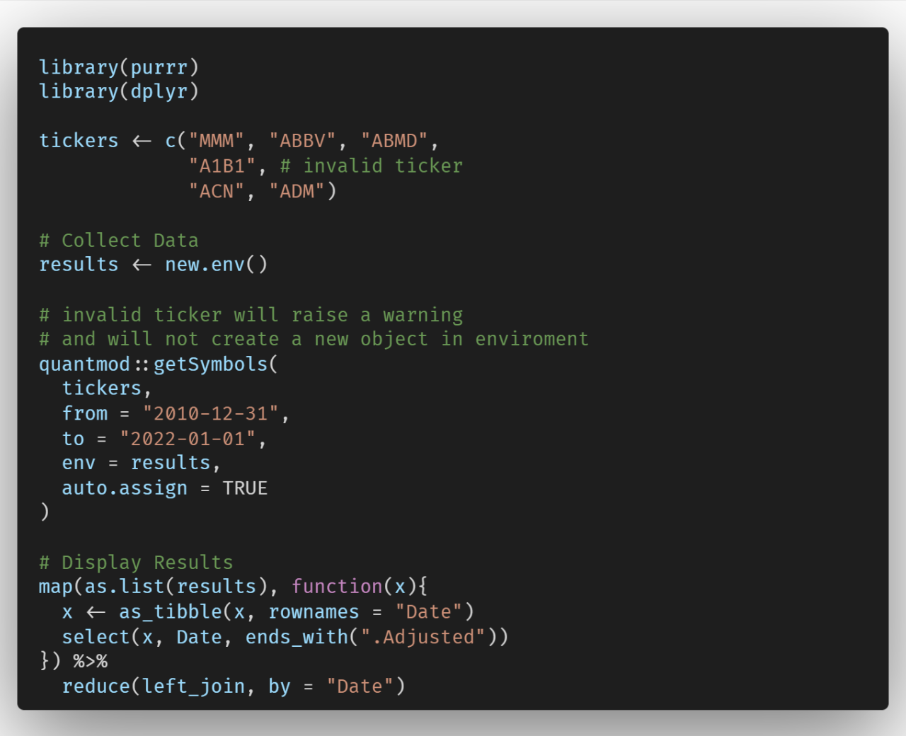
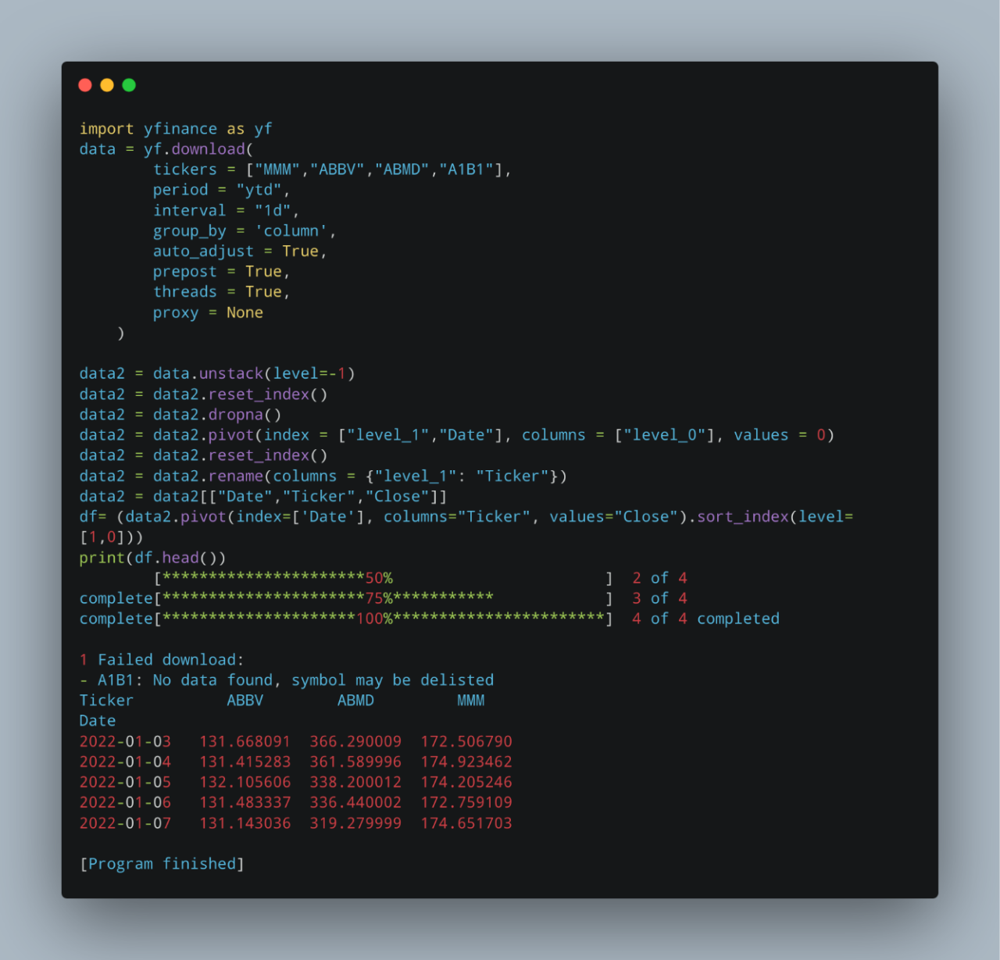

# R and Python Challenges

## Pulling data from Yahoo Finance and handling errors

### Original text on Linkedin

<https://www.linkedin.com/posts/activity-6969997960340193280-4vbp?utm_source=share&utm_medium=member_desktop>

This is a mini-project I worked on last week and got paid. First, I drafted a base R solution and in the second iteration a more robust solution with functional programming.

My final solution is six steps with piping. Curious to see python versions as well.

We have a list of hundreds of yahoo finance tickers. Some of them are inactive.

To simplify, let's take only 6. The ticker A1B1 is invalid.

tickers \<- c("MMM", "ABBV", "ABMD", "A1B1", \# invalid ticker "ACN", "ADM")

We use the function getSymbols from quantmod to extract the values. It will run into an error if we run an invalid ticker.

quantmod::getSymbols("MMM", from = "2010-12-31", to = "2022-01-01", env = NULL, auto.assign = FALSE)

It returns the Open, High, Low, Close, Volume, and Adjusted Price. All we need is the last column, Adjusted.

Finally, all results must be aggregated into a single tibble object, as per the screenshot (shows the first and last five rows, 2770 in total).

### Solution using functional programming in R

Invalid ticker A1B1 will cause an error: we use **possibly** from purrr which will return NULL when getSymbols will fail.\
Different tickers will have different inception dates. I use merge.xts from the package xts as it will by default perform an outer join and add all possible dates.\
Example: ticker A exists since 2015, ticker B since 2010. The left join from dplyr will omit five years of data.\
The dplyr alternative is the full join but as quantmod returns an xts object by definition, I opt for merge.xts.

```{r message=FALSE, cache = T}
suppressWarnings(suppressMessages(library(dplyr)));
suppressWarnings(suppressMessages(library(purrr)));
suppressWarnings(suppressMessages(library(tidyquant)));

tickers <- c("MMM", "ABBV", "ABMD",
            "A1B1", #invalid ticker
            "ACN", "ADM")


res = tickers %>% 
  map(possibly(.f = ~ quantmod::getSymbols(.x, from = "2010-12-31",
                                 to = "2022-01-01",
                                 env = NULL,
                                 auto.assign = FALSE)[,6],
               otherwise = NULL)) %>% 
  #from purrr, removing the NULL objects from a list
  discard(is.null) %>% 
  #from purrr, merging elements of a list using a specific function
  reduce(merge.xts) %>% 
  #converting the xts result to data.frame
  as.data.frame() %>% 
  #add Date as the first column
  mutate(Date = rownames(.) %>% as.Date(), .before = everything()) 
```

```{r echo=FALSE, cache = T}
head(res) %>% 
  kableExtra::kbl() %>% 
  kableExtra::kable_styling(full_width = F, position = 'left') %>% 
  kableExtra::kable_styling(font_size = 11) %>% 
  kableExtra::kable_styling(bootstrap_options = c("hover", "condensed")) 

tail(res) %>% 
  kableExtra::kbl() %>% 
  kableExtra::kable_styling(full_width = F, position = 'left') %>% 
  kableExtra::kable_styling(font_size = 11) %>% 
  kableExtra::kable_styling(bootstrap_options = c("hover", "condensed")) 

```

### Python Solution by Georgi Petkov

```{python, cache = T}
import yahoo_fin.stock_info as si
import pandas as pd

tickers = ["MMM", "ABBV", "ABMD","A1B1","ACN", "ADM"]

ticker_series = [] # store extracted data

missing_ticker =[] # store list of missing tickers

for ticker in tickers:
    try:
        s = si.get_data(ticker, start_date='2022-08-01', end_date='2022-08-28')['adjclose']
    except AssertionError:
        missing_ticker.append(ticker)
    ticker_series.append(s)    

cols = [ticker+'.Adjclose' for ticker in tickers if ticker not in missing_ticker]

df = pd.concat(ticker_series, keys=cols,axis=1)    

df.head()
```

### R Solution using env by Alexander Sevostianov

{width="600"}

### Python solution by Antonio Blago

{width="600"}
